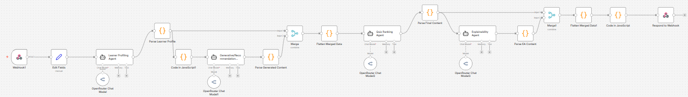

# Explainable Multi-Agent Generative Recommendation System for Personalized Learning

An AI-powered adaptive learning platform built with n8n, OpenRouter LLMs, and a Streamlit. 
The system analyzes learner performance, generates personalized quizzes, recommends learning resources, and provides explainable feedback to support personalized learning paths.

## Features
* Learner profiling based on course history and quiz performance
* Adaptive quiz generation using LLM
* Personalized learning resource recommendations
* Explainable AI feedback for quiz and resource selection
* Multi-agent workflow orchestration using n8n
* Retrieval-Augmented Content Generation (course knowledge base)
* Webhook-based API integration
* Streamlit frontend for learner interaction

## Architecture
**4 AI Agents**  
1. Learner Profiling Agent
2. Generative Content Agent
3. Quiz Ranking Agent
4. Explainability Agent

**Workflow**  



## Technologies Used
`n8n` `OpenRouter` `GPT-OSS-120B` `JavaScript` `Streamlit` `REST APIs`
  
## Project Structure

```text
.
├── workflow.json        # n8n workflow
├── index.html           # Streamlit UI
├── draft-paper.pdf      # Project report
└── README.md
```


